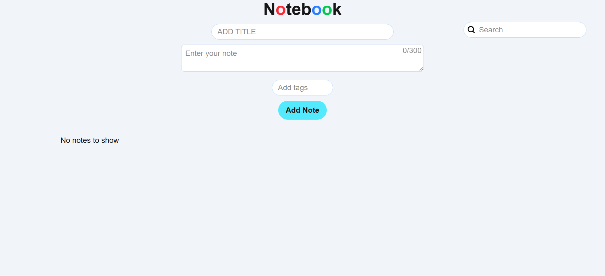

Live Demo:
https://my-notes-six-zeta.vercel.app/
# My Notes App
A fast and simple notes app built with Next.js that stores notes in the browser using localStorage.

## Features
- Add, edit and delete notes
- Search notes by text
- Colour coded notes
- Uppercase note titles
- Data saved in browser (no login required)

## Tech Stack
- Next.js
- React
- CSS

## How to run locally
1. Clone the repo
2. Install dependencies
3. ```bash
   npm install
   ```
   ## Run the app
   ```bash
   npm run dev
   ```
   
## Open in browser
http://localhost:3000
